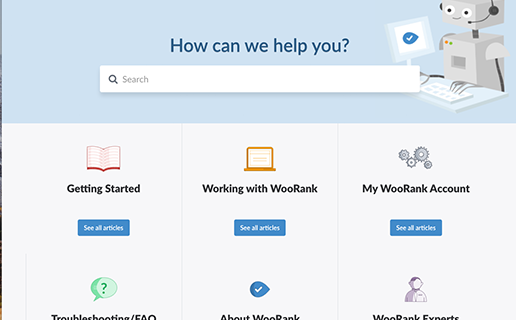

# WooRank Help Center Theme

The WooRank HelpCenter theme is based on the default Zendesk Guide theme.

## How to update
- Fetch the branch locally
- Work on your updates
- Update manifest.json version
- Merge updates to master branch
- Update theme to latest version on Zendesk (Kebap menu, Update from GitHub option)

